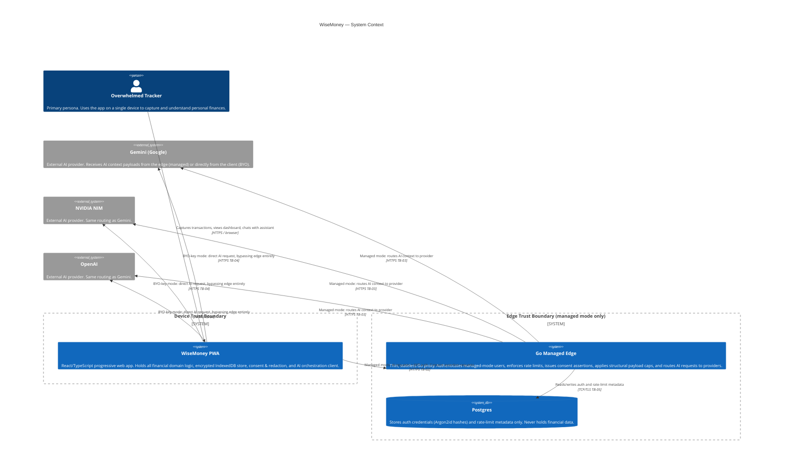

# C4 Level 1 — System Context

**Source:** ARCHITECTURE v0.1 · THREAT_MODEL v0.1 · CONTRACT v0.1
**Date:** 2026-06-02

WiseMoney is a local-first personal finance PWA. The user interacts with a
single browser-resident application that handles all domain and financial logic
on-device. Two AI-request paths exist and are structurally distinct: in managed
mode every AI request crosses the Go edge before reaching a provider; in BYO-key
mode the client talks to a provider directly, with no edge or cloud dependency.
The Go edge and Postgres are absent from the BYO-key path entirely. Trust
boundaries are drawn at the device, the Go edge process, the Postgres store, and
each external AI provider.

## Legend

| Trust boundary | Contents |
|---|---|
| Device | PWA, IndexedDB (encrypted), BYO key material (encrypted), consent state (localStorage) |
| Edge | Go process, JWT signing key, managed provider API keys — never financial data |
| Postgres | Auth hashes, rate-limit metadata — never financial data |
| AI providers | External; outside operator control once a request is sent |

**Financial data** (event log, transactions, balances) never crosses the device
boundary except through explicit user consent via the AI egress path or an
explicit export action. The Go edge and Postgres hold **no financial data** at any
time (INV-PROXY-01, Gate-4 decision 20).

In BYO-key mode the Go edge, Postgres, and all cloud dependencies are **absent
from every request path**. No authentication is required (INV-AUTH-05).
