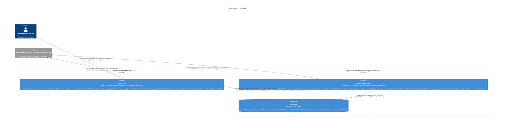

# C4 Level 2 — Container

**Source:** ARCHITECTURE v0.1 · THREAT_MODEL v0.1 · CONTRACT v0.1
**Date:** 2026-06-02

There are three deployment units: the PWA static host (React/TypeScript,
served as a progressive web app), the Go managed edge (single static binary in a
distroless container), and Postgres. The PWA client holds all financial domain
logic and the entire user data store; the Go edge is strictly an auth + proxy
layer with no domain logic. The BYO-key bypass is shown explicitly: in that mode
the client calls the AI provider directly and none of the three deployment units
on the managed path are contacted. Postgres is accessible only from the Go edge
container on the internal Docker network.

## Data-flow constraints

| Flow | Carries financial data? | Notes |
|---|---|---|
| PWA client → Go edge (managed) | Conditionally — only if user granted per-feature full-egress consent | Redacted requests contain aggregates only (INV-EGR-01). Edge applies structural payload cap regardless of client claim. |
| Go edge → AI provider (managed) | Same condition as above | Edge never retains payload after response cycle (INV-PROXY-01). |
| PWA client → AI provider (BYO) | Conditionally — client-side consent enforcement only | No server boundary; client consent subsystem is the sole gate (INV-EGR-03b, AQ-02 accepted). |
| Go edge → Postgres | Never | Postgres schema has no financial data columns. |
| Any → Postgres | Never | Hard architectural invariant (Gate-4 decision 20). |

## Legend

| Trust boundary | Financial data present? |
|---|---|
| Device (PWA client + IndexedDB) | Yes — encrypted at rest (INV-PERS-02) |
| Go edge process | Never persisted; only in-flight in managed-mode AI request if consent granted |
| Postgres | Never |
| AI providers | Yes, if and only if consent granted for the specific feature |

BYO-key mode: the Go edge container and Postgres are **not in any request path**.
The user operates with zero cloud dependency (INV-AUTH-05).
