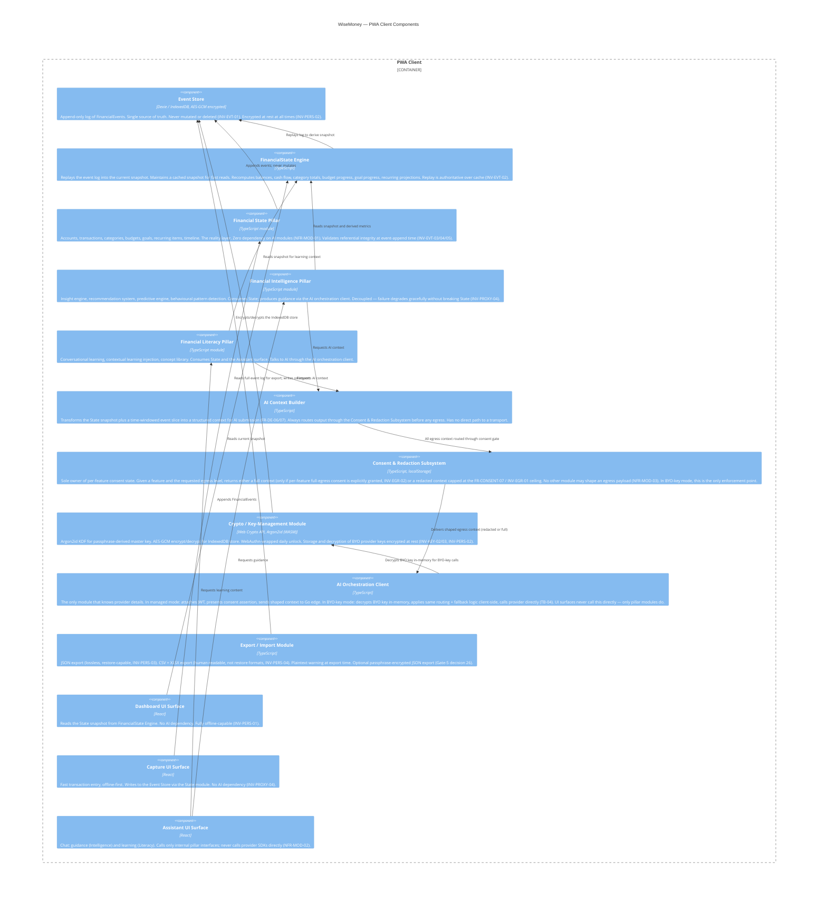
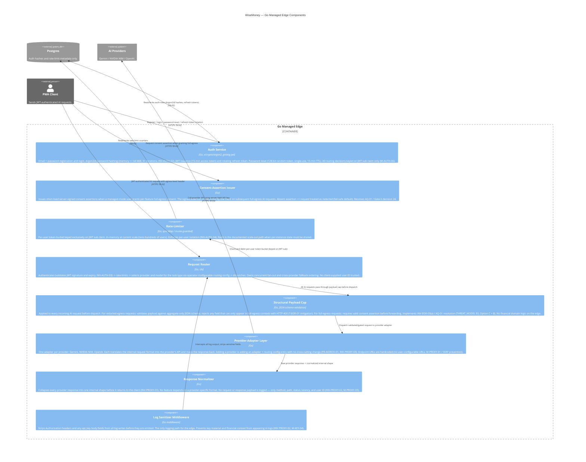

# C4 Level 3 — Component

**Source:** ARCHITECTURE v0.1 · THREAT_MODEL v0.1 · CONTRACT v0.1
**Date:** 2026-06-02

This level decomposes the two non-trivial containers: the PWA client and the Go
managed edge. The PWA client contains all financial domain modules and the AI
orchestration path; the Go edge is decomposed into its auth, rate-limiting,
routing, adapter, normalization, and consent-assertion components. Module
dependency rules from ARCHITECTURE §12 are reflected: the Financial State module
has no dependency on AI modules; the UI surfaces depend only on internal
interfaces; only the Consent & Redaction Subsystem touches consent state.

---

## Part A — PWA Client components

---

## Part B — Go Managed Edge components

---

## Legend

| Trust boundary | Financial data present? | Notes |
|---|---|---|
| Device (PWA client) | Yes — encrypted at rest | All domain logic and data here |
| Go edge — in-flight | Only in managed full-egress requests, consent-gated | Payload cap enforces this at the boundary |
| Go edge — persisted | Never | INV-PROXY-01: edge retains nothing financial after a request cycle |
| Postgres | Never | No financial schema; auth and rate-limit metadata only |
| AI providers | Yes, if and only if per-feature consent granted | Provider-side retention is a residual disclosed risk |

**Module dependency rules enforced (ARCHITECTURE §12):**
- Financial State Pillar has zero compile-time or runtime dependency on Intelligence, Literacy, or the AI Orchestration Client.
- UI surfaces call only internal pillar interfaces; they never call provider SDKs.
- Only the Consent & Redaction Subsystem reads or writes consent state (localStorage).
- The Go edge holds no domain or financial logic.
