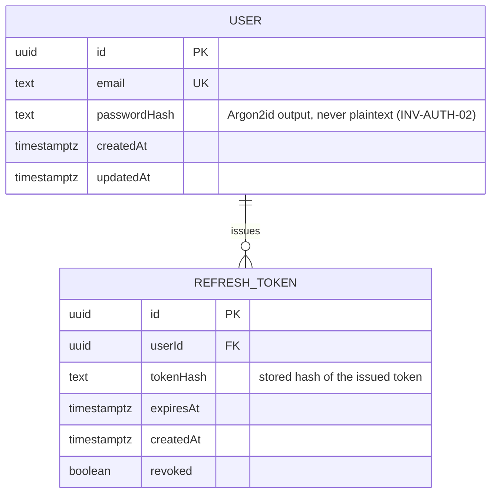

# WiseMoney — Domain / ER Model

| Field   | Value                          |
| ------- | ------------------------------ |
| Title   | Domain / ER Model              |
| Date    | 2026-06-02                     |
| Version | MODELING T-S0-01 v0.1          |
| Status  | Draft                          |
| Owner   | Shallum (databases)            |
| Source  | CONTRACT v0.1; SRS v0.1 Rev 2026-06-02; ARCHITECTURE v0.1; intake/intent-v0.1.md |

> This document is a design artifact only. No DDL, no migration execution.
> Execution is owned by Y4NN.

---

## 1. Client domain model — IndexedDB (Dexie, AES-GCM encrypted)

All financial data lives exclusively on-device in an encrypted IndexedDB store
(INV-PERS-01, INV-PERS-02, CON-03). The Go edge never sees this data
(INV-PROXY-01).

### 1.1 Money value object

Every monetary attribute in every entity below uses the Money value object.
Floats are **forbidden** at every storage and transmission boundary (INV-MON-01).

```
Money {
  minorUnits : integer   -- exact, no float
  currency   : string    -- ISO-4217 (e.g. "EUR", "USD", "GBP")
}
```

### 1.2 Domain entity diagram

```mermaid
classDiagram

    %% Value object
    class Money {
        +integer minorUnits
        +string  currency
    }

    %% Core entities
    class Account {
        +string  id
        +string  name
        +string  type
        +Money   initialBalance
        +Money   currentBalance
        +boolean isActive
        +string  currency
        note: currency immutable from creation (INV-MON-02, ARCH 6)
    }

    class Category {
        +string  id
        +string  name
        +boolean isSystemDefault
        +string  parentId
        note: self-referential; parentId nullable (INV-EVT-03)
    }

    class Transaction {
        +string   id
        +Money    amount
        +string   direction
        +string   accountId
        +string   categoryId
        +datetime timestamp
        +string   note
        +string[] tags
        note: direction is income or expense
    }

    class Budget {
        +string  id
        +string  categoryId
        +string  periodMonth
        +Money   limit
        +Money   spent
        note: spent is derived; periodMonth format is YYYY-MM
    }

    class Goal {
        +string  id
        +string  name
        +Money   targetAmount
        +Money   accumulatedAmount
        +date    targetDate
        note: accumulatedAmount derives from GoalContributions only (INV-EVT-04)
    }

    class GoalContribution {
        +string   id
        +string   goalId
        +Money    amount
        +datetime timestamp
        note: sole mechanism that grows Goal.accumulatedAmount (INV-EVT-04)
    }

    class RecurringItem {
        +string   id
        +string   label
        +Money    amount
        +string   direction
        +string   categoryId
        +string   frequency
        +date     startDate
        note: occurrences are derived never written to event log until realised (INV-EVT-05)
    }

    class FinancialEvent {
        +string   id
        +string   type
        +datetime timestamp
        +string   actor
        +object   payload
        note: append-only immutable (INV-EVT-01); sole source of truth (INV-EVT-02)
    }

    class FinancialState {
        +Money    totalBalance
        +Money    periodIncome
        +Money    periodExpenses
        +Money    netCashFlow
        +map      categoryTotals
        +map      budgetProgress
        +map      goalProgress
        +list     projectedRecurring
        note: derived by replaying FinancialEvent log (INV-EVT-02); replay wins over cache
    }

    class FxRateEntry {
        +string   baseCurrency
        +string   quoteCurrency
        +string   rate
        +datetime lastUpdated
        note: rate stored as high-precision string not float; user-editable; conversion is display-only (INV-MON-03/04); rounding is half-even (INV-MON-05)
    }

    %% Relationships
    Account "1" --> "1" Money : initialBalance (value object)
    Account "1" --> "1" Money : currentBalance (value object)

    Account "1" --> "0..*" Transaction : owns
    Category "1" --> "0..*" Transaction : classifies
    Category "0..1" --> "0..*" Category : parent of

    Category "1" --> "0..*" Budget : targets
    Goal "1" --> "1..*" GoalContribution : accumulates via

    Category "1" --> "0..*" RecurringItem : classifies

    Transaction "1" --> "1" Money : amount (value object)
    Budget "1" --> "1" Money : limit (value object)
    Budget "1" --> "1" Money : spent (value object derived)
    Goal "1" --> "1" Money : targetAmount (value object)
    Goal "1" --> "1" Money : accumulatedAmount (value object derived)
    GoalContribution "1" --> "1" Money : amount (value object)
    RecurringItem "1" --> "1" Money : amount (value object)

    FinancialEvent "0..*" --> "1" FinancialState : replayed into (derived)
    FinancialEvent "0..*" --> "0..1" Account : references
    FinancialEvent "0..*" --> "0..1" Category : references
    FinancialEvent "0..*" --> "0..1" Goal : references
    FinancialEvent "0..*" --> "0..1" Budget : references
    FinancialEvent "0..*" --> "0..1" RecurringItem : references
```



### 1.3 FinancialEvent type enumeration

All event types enumerated in FR-DE-01:

| Type                      | Payload subject           | Invariant enforced      |
| ------------------------- | ------------------------- | ----------------------- |
| `transaction_created`     | Transaction               | INV-EVT-01, INV-EVT-03  |
| `transaction_updated`     | Transaction delta         | INV-EVT-01              |
| `transaction_deleted`     | Transaction id            | INV-EVT-01              |
| `budget_updated`          | Budget                    | INV-EVT-01, INV-EVT-03  |
| `goal_created`            | Goal                      | INV-EVT-01, INV-EVT-04  |
| `goal_updated`            | Goal delta                | INV-EVT-01, INV-EVT-04  |
| `recurring_item_created`  | RecurringItem             | INV-EVT-01, INV-EVT-05  |
| `recurring_item_updated`  | RecurringItem delta       | INV-EVT-01, INV-EVT-05  |
| `insight_generated`       | Insight payload           | INV-EVT-01              |
| `learning_interaction`    | Interaction payload       | INV-EVT-01              |

Event envelope (FR-DE-02):
- `id` — stable UUID, never reused
- `type` — one of the ten types above
- `timestamp` — ISO-8601 UTC, system-assigned at append
- `actor` — `"user"` or `"system"`
- `payload` — type-specific, must contain sufficient data to reconstruct the change

### 1.4 Source-of-truth relationship (INV-EVT-02)

FinancialState is not an entity in the same sense as Account or Transaction. It is
a read projection derived by folding the entire FinancialEvent log. The cached
snapshot is an optimisation — if the cache and a fresh replay disagree, the replay
result is the authoritative value. The diagram expresses this with the
`replayed into (derived)` arrow from FinancialEvent to FinancialState; no reverse
arrow exists.

---

## 2. Edge auth store — Postgres (Go edge only)

This store holds **no financial data whatsoever** (INV-PROXY-01). It exists solely
to allow the Go edge to authenticate managed-mode users and enforce per-user
rate-limiting. BYO-key mode never touches this store (INV-AUTH-05).



Notes:
- `USER.passwordHash` holds the Argon2id salted hash (ARCHITECTURE §2.2,
  INV-AUTH-02). No plaintext credential column exists.
- JWTs are signed with a server-only signing key (INV-AUTH-03). That key is a
  runtime environment value injected via SOPS/age; it is never stored in this
  schema.
- `REFRESH_TOKEN` enables JWT rotation. Rotation policy lifetime, single-use
  semantics, and family invalidation are owned by the THREAT_MODEL (Benaiah).
- **`RATE_LIMIT_BUCKET` is NOT a Postgres table at MVP.** Gate-4 decision 20
  specifies in-memory token-bucket (Go process-level map). Redis is the
  documented scale-out path (ARCHITECTURE §11). The `RATE_LIMIT_BUCKET` entity
  previously shown in this diagram is removed; see `docs/modeling/data-model.md`
  §B.1 for the full in-memory design and scale-out path.
- No column in this schema references a transaction, account, balance, category,
  budget, goal, or any financial concept.

---

## 3. Modeling notes

### Store assignment

| Entity               | Store                   | Reason                                             |
| -------------------- | ----------------------- | -------------------------------------------------- |
| Account              | Client IndexedDB        | Financial data, local-only (INV-PERS-01/05)        |
| Transaction          | Client IndexedDB        | Financial data, local-only                         |
| Category             | Client IndexedDB        | Financial classification, local-only               |
| Budget               | Client IndexedDB        | Financial data, local-only                         |
| Goal                 | Client IndexedDB        | Financial data, local-only                         |
| GoalContribution     | Client IndexedDB        | Financial data, event-sourced (INV-EVT-04)         |
| RecurringItem        | Client IndexedDB        | Financial data; projections derived, never stored  |
| FinancialEvent       | Client IndexedDB        | Source of truth, append-only (INV-EVT-01)          |
| FinancialState       | Client memory / cache   | Derived projection; replay is authoritative        |
| FxRateEntry          | Client IndexedDB        | User-editable, encrypted at rest (ARCH §5)         |
| User                 | Edge Postgres           | Auth identity only                                 |
| RefreshToken         | Edge Postgres           | JWT rotation only                                  |
| RateLimitBucket      | Edge in-memory (Go); Redis on scale-out — no Postgres table at MVP | Per-user isolation (INV-AUTH-04) — Gate-4 decision 20 |

### Invariant traceability

| Invariant    | Satisfied by                                                           |
| ------------ | ---------------------------------------------------------------------- |
| INV-MON-01   | Money value object — integer minorUnits, no float column anywhere      |
| INV-MON-02   | Account.currency — set at creation, no update path                     |
| INV-MON-03   | FxRateEntry — local table, no live call in conversion path             |
| INV-MON-04   | Conversion reads FxRateEntry; stored Transaction.amount never mutated  |
| INV-MON-05   | Conversion sites apply half-even rounding (application-layer rule)     |
| INV-EVT-01   | FinancialEvent — no update or delete operation; append path only       |
| INV-EVT-02   | FinancialState — derived from replay; cache is subordinate             |
| INV-EVT-03   | Event payload validates accountId + categoryId at append time          |
| INV-EVT-04   | Goal.accumulatedAmount — read-only sum of GoalContribution.amount      |
| INV-EVT-05   | RecurringItem projections computed in memory, never appended           |
| INV-AUTH-02  | User.passwordHash — Argon2id only, no plaintext column                 |
| INV-PROXY-01 | Edge Postgres schema — zero financial columns                          |
| INV-PERS-02  | Entire IndexedDB store is AES-GCM encrypted (Crypto module, ARCH §7)  |

### FX rates

`FxRateEntry` is keyed by `(baseCurrency, quoteCurrency)`. The `rate` field is
stored as a high-precision decimal string, not a float, to avoid binary
floating-point representation errors. Each entry carries `lastUpdated`. Staleness
is surfaced in the UI; it never blocks conversion. The table lives inside the
encrypted IndexedDB store (ARCHITECTURE §5, INV-PERS-02).

### RecurringItem projections

RecurringItem stores the schedule definition only. Projected occurrences are
computed in memory by the FinancialState Engine and surface in
`FinancialState.projectedRecurring`. They are never written to the FinancialEvent
log until the user explicitly realises one as a Transaction (INV-EVT-05).

### What this model does not include

- Consent state — stored in localStorage, not IndexedDB; it is a UI/subsystem
  concern with no entity-level representation in the domain model.
- BYO provider keys — stored encrypted in IndexedDB (INV-KEY-02/03) but are
  key-management artifacts, not domain entities; modeled in ARCHITECTURE §7.
- AI context / egress payloads — transient, never persisted (INV-PROXY-01).

---

*End of MODELING T-S0-01 v0.1. Next in sequence: Alembic migration design for the
edge Postgres schema (separate task, not executed here). Client IndexedDB Dexie
table definitions follow implementation sequencing.*
