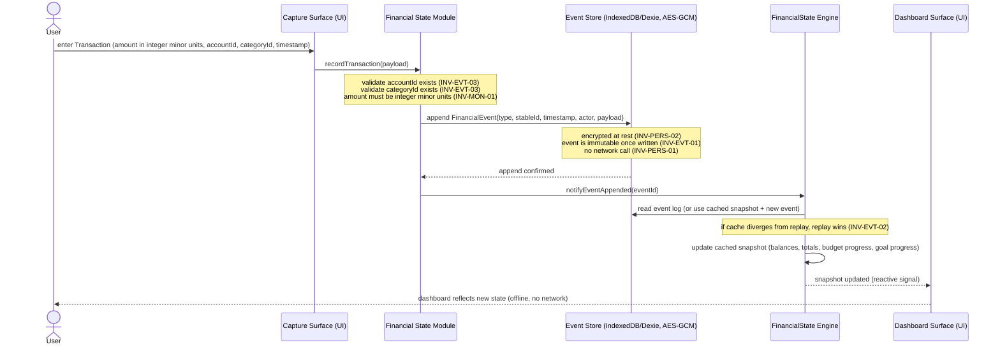

# WiseMoney — Sequence Diagrams

| Field   | Value                                              |
| ------- | -------------------------------------------------- |
| Title   | WiseMoney — Sequence Diagrams                  |
| Date    | 2026-06-02                                         |
| Version | UML v0.1                                           |
| Status  | Draft                                              |
| Owner   | Nathan (software architecture)                     |
| Source  | CONTRACT v0.1; ARCHITECTURE v0.1; THREAT_MODEL v0.1 |
| Sprint  | MODELING T-S0-01                                   |

---

## (a) Offline capture — FinancialEvent append — snapshot update

INV-PERS-01: succeeds with no network. INV-EVT-01: append-only. INV-MON-01: amount is integer minor units.



---

## (b) Managed-mode AI request — redacted path and full path

INV-AUTH-01/02/03: JWT required. INV-EGR-01/02/03(a): edge is enforcement point.
THREAT_MODEL §3 (AQ-01 resolution): structural payload cap + signed consent assertion for full-egress.

```mermaid
sequenceDiagram
    actor User
    participant Feature as AI Feature (Intelligence / Literacy)
    participant CtxBuilder as AI Context Builder
    participant ConsentSub as Consent & Redaction Subsystem
    participant AIOrchestr as AI Orchestration Client
    participant GoEdge as Go Edge (Auth / RateLimiter / Router)
    participant SPC as StructuralPayloadCap (Go middleware)
    participant CAI as ConsentAssertionIssuer (Go endpoint)
    participant ProvAdapter as Provider Adapter
    participant Normalizer as Response Normalizer
    participant Provider as AI Provider (Gemini / NIM / OpenAI)

    User->>Feature: request AI insight / conversation
    Feature->>CtxBuilder: buildContext(featureId, timeWindow)
    CtxBuilder->>ConsentSub: shapeEgress(featureId, rawContext)
    note over ConsentSub: sole owner of consent state (NFR-MOD-03)<br/>reads localStorage consent for featureId<br/>if clear/absent → treat as not-granted (M-EGR-02)

    alt per-feature consent = redacted (default)
        ConsentSub-->>CtxBuilder: redactedContext (aggregates only: period totals, budget %, goal %, trend — INV-EGR-01)
        CtxBuilder->>AIOrchestr: submit(redactedContext, X-Egress-Level: redacted)
        AIOrchestr->>GoEdge: POST /ai/request {payload, X-Egress-Level: redacted} + JWT
        GoEdge->>GoEdge: validate JWT signature + expiry (INV-AUTH-01/03)
        GoEdge->>GoEdge: per-user rate-limit check (INV-AUTH-04, JWT sub only)
        GoEdge->>SPC: validatePayload(payload, mode=redacted)
        note over SPC: structural schema check — reject any field<br/>that can only appear in full-egress<br/>(individual amounts, dates, merchant, notes)<br/>returns 400 if violation detected (INV-EGR-03a)
        SPC-->>GoEdge: schema valid
        GoEdge->>ProvAdapter: dispatch(redactedContext, taskType)
        ProvAdapter->>Provider: provider-specific API call (TLS, TB-03)
        Provider-->>ProvAdapter: provider response
        ProvAdapter->>Normalizer: normalize(providerResponse)
        Normalizer-->>GoEdge: internalShape (INV-PROXY-03)
        GoEdge-->>AIOrchestr: normalized response
        AIOrchestr-->>Feature: AI result
        Feature-->>User: render insight / answer

    else per-feature consent = full (explicit opt-in, INV-EGR-02)
        note over ConsentSub: consent granted for this specific featureId only<br/>cross-feature bleed forbidden (INV-EGR-02)
        ConsentSub-->>CtxBuilder: fullContext (raw transaction detail included)

        note over AIOrchestr: must present server-signed consent assertion<br/>assertion obtained at consent-grant time (CAI endpoint)
        AIOrchestr->>CAI: POST /consent/assert {featureId, userId} + JWT
        CAI->>CAI: validate JWT; issue signed assertion<br/>{userId, featureId, level=full, expiresAt=short-lived}
        CAI-->>AIOrchestr: signedConsentAssertion

        AIOrchestr->>GoEdge: POST /ai/request {payload, X-Egress-Level: full, consentAssertion} + JWT
        GoEdge->>GoEdge: validate JWT (INV-AUTH-01/03)
        GoEdge->>GoEdge: per-user rate-limit (INV-AUTH-04)
        GoEdge->>SPC: validateConsentAssertion(assertion, featureId)
        note over SPC: validate signature + expiry of assertion<br/>absent or invalid → treat as redacted (fail-safe)<br/>valid → forward without field-level inspection
        SPC-->>GoEdge: assertion valid — full-egress permitted
        GoEdge->>ProvAdapter: dispatch(fullContext, taskType)
        ProvAdapter->>Provider: provider-specific API call (TLS, TB-03)
        Provider-->>ProvAdapter: provider response
        ProvAdapter->>Normalizer: normalize(providerResponse)
        Normalizer-->>GoEdge: internalShape
        GoEdge-->>AIOrchestr: normalized response
        AIOrchestr-->>Feature: AI result
        Feature-->>User: render insight / answer
    end
```

---

## (c) BYO-key AI request

INV-AUTH-05: no auth, no edge contact. INV-KEY-02: BYO key never to edge. INV-EGR-03(b): client-side enforcement accepted.

```mermaid
sequenceDiagram
    actor User
    participant Feature as AI Feature
    participant CtxBuilder as AI Context Builder
    participant ConsentSub as Consent & Redaction Subsystem
    participant AIOrchestr as AI Orchestration Client (client-side routing + adapters)
    participant CryptoMod as Crypto / Key-Mgmt Module
    participant Provider as AI Provider (user-chosen)

    User->>Feature: request AI insight / conversation
    Feature->>CtxBuilder: buildContext(featureId, timeWindow)
    CtxBuilder->>ConsentSub: shapeEgress(featureId, rawContext)
    note over ConsentSub: client-side enforcement only (INV-EGR-03b)<br/>user is sole principal, key-holder, data subject<br/>consent clear → not-granted; re-prompt required<br/>UI must clearly indicate no server enforcement

    ConsentSub-->>CtxBuilder: shaped context (redacted or full per per-feature consent)
    CtxBuilder->>AIOrchestr: submit(shapedContext, taskType)

    note over AIOrchestr: BYO-key path — proxy bypassed entirely (INV-AUTH-05)<br/>client-side routing config + per-provider adapters<br/>no JWT, no edge, no Postgres

    AIOrchestr->>CryptoMod: decryptBYOKey(featureProviderKeyId)
    note over CryptoMod: key decrypted in-memory only (INV-KEY-02)<br/>never sent to Go edge, never logged<br/>provider endpoint from hardcoded allow-list (M-KEY-03)
    CryptoMod-->>AIOrchestr: providerKey (in-memory, scoped to this call)

    AIOrchestr->>Provider: direct HTTPS call (TB-04) with providerKey + shaped context
    note over AIOrchestr: client-side cross-provider fallback if primary fails<br/>key zeroed from memory after call completes

    Provider-->>AIOrchestr: response
    AIOrchestr->>AIOrchestr: normalize to internal shape (INV-PROXY-03, client-side)
    AIOrchestr-->>Feature: normalized result
    Feature-->>User: render insight / answer
```

---

## (d) Auth — register / login — JWT issue — request validation

INV-AUTH-01/02/03/04.

```mermaid
sequenceDiagram
    actor User
    participant ClientAuth as PWA Auth Flow
    participant GoEdge as Go Edge (Auth Service)
    participant Postgres as Postgres (auth + rate-limit metadata only)

    rect rgb(240,248,255)
        note right of User: Registration
        User->>ClientAuth: submit email + password
        ClientAuth->>GoEdge: POST /register {email, password}
        GoEdge->>GoEdge: Argon2id(password, salt) → hash (INV-AUTH-02, ≥64MiB/3 iter)
        GoEdge->>Postgres: INSERT user(email, argon2id_hash, salt)
        note over Postgres: no financial data ever stored (INV-PROXY-01)
        Postgres-->>GoEdge: ok
        GoEdge-->>ClientAuth: 201 Created
        ClientAuth-->>User: account created
    end

    rect rgb(240,255,240)
        note right of User: Login
        User->>ClientAuth: submit email + password
        ClientAuth->>GoEdge: POST /login {email, password}
        GoEdge->>Postgres: SELECT argon2id_hash WHERE email=?
        note over GoEdge: per-IP + per-account rate limit on /login (M-AUTH-01)<br/>constant-time comparison (M-AUTH-03)<br/>identical error for wrong password vs no account (M-AUTH-03)
        GoEdge->>GoEdge: Argon2id verify(inputPassword, storedHash)
        GoEdge->>GoEdge: issue JWT(sub=userId, exp=now+15min) signed by server-only key (INV-AUTH-03)
        GoEdge->>GoEdge: issue refreshToken(random 128-bit, TTL=longer, bound to userId)
        GoEdge->>Postgres: store refreshToken(hash, userId, expiresAt)
        GoEdge-->>ClientAuth: {accessJWT, refreshToken}
        ClientAuth-->>User: logged in
    end

    rect rgb(255,248,240)
        note right of User: Proxied AI request (JWT validation)
        ClientAuth->>GoEdge: POST /ai/request + Authorization: Bearer {accessJWT}
        GoEdge->>GoEdge: validate JWT signature (server-only key) + expiry (INV-AUTH-01/03)
        note over GoEdge: all routing keyed on JWT sub claim only<br/>no client-supplied userId trusted (M-AUTH-06)
        GoEdge->>GoEdge: per-user rate-limit (token-bucket keyed on JWT sub, INV-AUTH-04)
        GoEdge-->>ClientAuth: proceed to AI routing (see sequence b)
    end

    rect rgb(255,240,255)
        note right of User: Token refresh
        ClientAuth->>GoEdge: POST /auth/refresh {refreshToken}
        GoEdge->>Postgres: lookup refreshToken hash; validate not expired + not used
        GoEdge->>Postgres: invalidate old refreshToken (rotation — M-AUTH-05)
        GoEdge->>GoEdge: issue new accessJWT + new refreshToken
        GoEdge-->>ClientAuth: {newAccessJWT, newRefreshToken}
    end
```

---

## (e) Hybrid key management — passphrase setup + WebAuthn daily unlock + recovery

ARCHITECTURE §7. INV-PERS-02, INV-KEY-03.

```mermaid
sequenceDiagram
    actor User
    participant SetupUI as Setup / Unlock UI
    participant CryptoMod as Crypto / Key-Mgmt Module
    participant WebCrypto as Web Crypto API (browser)
    participant WebAuthn as WebAuthn / Biometric (platform authenticator)
    participant IDB as IndexedDB (AES-GCM encrypted store)

    rect rgb(240,248,255)
        note right of User: Passphrase setup (first run)
        User->>SetupUI: enter passphrase (entropy check enforced, M-KEY-01)
        SetupUI->>CryptoMod: setupMasterKey(passphrase)
        CryptoMod->>WebCrypto: Argon2id(passphrase, salt, memory≥64MiB, iter≥3, parallelism) → masterKey
        note over CryptoMod: passphrase never stored (INV-KEY-03)<br/>Argon2id params + salt stored alongside encrypted store<br/>for re-derivation on restore
        CryptoMod->>WebCrypto: AES-GCM encrypt(IndexedDB store key, masterKey)
        WebCrypto-->>CryptoMod: encryptedStoreKey
        CryptoMod->>IDB: persist(encryptedStoreKey, argon2idParams, salt)
        note over IDB: no plaintext key material in persistent storage (INV-KEY-03)

        CryptoMod->>WebAuthn: wrap masterKey for daily unlock convenience
        note over WebAuthn: WebAuthn is convenience layer only<br/>passphrase remains cryptographic root of trust<br/>user informed: passphrase loss = data loss (M-KEY-02)
        WebAuthn-->>CryptoMod: wrappedMasterKey (bound to authenticator)
        CryptoMod->>IDB: persist(wrappedMasterKey)
        CryptoMod-->>SetupUI: setup complete; masterKey in memory for session
    end

    rect rgb(240,255,240)
        note right of User: Daily unlock (WebAuthn / biometric)
        User->>SetupUI: open app (returning session)
        SetupUI->>CryptoMod: unlockWithWebAuthn()
        CryptoMod->>IDB: read(wrappedMasterKey)
        CryptoMod->>WebAuthn: biometric gesture / authenticator
        WebAuthn-->>CryptoMod: unwrapped masterKey
        CryptoMod-->>SetupUI: unlocked; masterKey in memory for session
        note over CryptoMod: passphrase not required for daily unlock<br/>passphrase re-entry required for export or device transfer
    end

    rect rgb(255,248,240)
        note right of User: Recovery (lost device — restore from JSON export)
        User->>SetupUI: import JSON export on new device
        SetupUI->>CryptoMod: restoreFromExport(exportBlob, passphrase)
        CryptoMod->>WebCrypto: Argon2id(passphrase, storedSalt, storedParams) → masterKey
        note over CryptoMod: re-derive masterKey from passphrase (Gate-4 decision 19)<br/>Argon2id params embedded in export (INV-PERS-03 losslessness)
        CryptoMod->>WebCrypto: AES-GCM decrypt(encryptedStoreKey, masterKey)
        CryptoMod->>IDB: restore event log + all entity records (INV-PERS-03)
        CryptoMod-->>SetupUI: restore complete; state identical to export point
    end
```

---

## (f) Export (plaintext + opt-in passphrase-encrypted) and restore from JSON

INV-PERS-03: lossless. INV-PERS-04: CSV/XLSX not restore formats. FR-PERSIST-08.

```mermaid
sequenceDiagram
    actor User
    participant ExportUI as Export / Import UI
    participant ExportMod as Export / Import Module
    participant IDB as IndexedDB (Event Store + entity records)
    participant CryptoMod as Crypto / Key-Mgmt Module
    participant FS as Filesystem / Download

    rect rgb(240,248,255)
        note right of User: JSON export (plaintext, opt-in encrypted)
        User->>ExportUI: request JSON export
        ExportUI-->>User: warn — exported file contains complete financial history in plaintext;<br/>treat as credential; store securely (M-EXPORT-01, I-EXPORT-01)
        User->>ExportUI: confirm + optional: enable encrypted export
        ExportUI->>ExportMod: exportJSON(encrypt=false|true, exportPassphrase?)
        ExportMod->>IDB: read full event log (all FinancialEvents, immutable)
        ExportMod->>IDB: read all entity records (accounts, categories, budgets, goals, recurring items)
        ExportMod->>ExportMod: assemble lossless JSON blob (INV-PERS-03: full event log + entity refs + argon2id params + salt)
        note over ExportMod: CSV/XLSX exports: human-readable summaries only<br/>explicitly NOT restore formats (INV-PERS-04)<br/>UI must not label them as backup

        alt encrypted export chosen (FR-PERSIST-08)
            ExportMod->>CryptoMod: encryptExport(jsonBlob, exportPassphrase)
            CryptoMod->>CryptoMod: Argon2id(exportPassphrase, newSalt) → exportKey
            CryptoMod->>CryptoMod: AES-GCM encrypt(jsonBlob, exportKey)
            CryptoMod-->>ExportMod: encryptedBlob + salt + argon2idParams
        end

        ExportMod->>FS: download file to user device
        FS-->>User: file saved (plaintext or encrypted JSON)
    end

    rect rgb(240,255,240)
        note right of User: Restore from JSON (INV-PERS-03)
        User->>ExportUI: select JSON export file for import
        ExportMod->>ExportMod: detect if encrypted (header flag)
        alt encrypted export
            ExportMod->>CryptoMod: decryptExport(encryptedBlob, exportPassphrase)
            CryptoMod->>CryptoMod: Argon2id re-derive exportKey from stored salt + params
            CryptoMod-->>ExportMod: jsonBlob
        end
        ExportMod->>ExportMod: validate JSON schema (event log integrity, referential IDs)
        ExportMod->>IDB: write event log (append-only; all events restored, INV-EVT-01)
        ExportMod->>IDB: write entity records (accounts, categories, budgets, goals)
        note over IDB: after import, state indistinguishable from state at export time (INV-PERS-03)
        ExportMod-->>ExportUI: restore complete
        ExportUI-->>User: state restored; dashboard reflects exported state
    end
```
