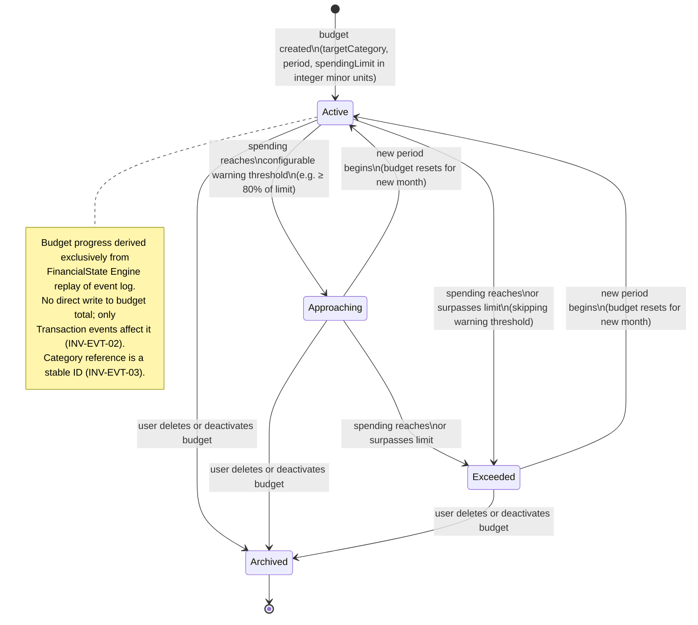

# WiseMoney — State Machine Diagrams

| Field   | Value                                              |
| ------- | -------------------------------------------------- |
| Title   | WiseMoney — State Machine Diagrams             |
| Date    | 2026-06-02                                         |
| Version | UML v0.1                                           |
| Status  | Draft                                              |
| Owner   | Nathan (software architecture)                     |
| Source  | CONTRACT v0.1; ARCHITECTURE v0.1; THREAT_MODEL v0.1 |
| Sprint  | MODELING T-S0-01                                   |

---

## Per-feature consent state machine

Security-critical. INV-EGR-01/02/03. Redacted is the safe default and the fallback for any unclear state.
Only the Consent & Redaction Subsystem drives transitions (NFR-MOD-03).

```mermaid
stateDiagram-v2
    [*] --> NotPrompted : feature first accessed

    NotPrompted --> Redacted : user dismisses prompt\nor declines consent
    NotPrompted --> ConsentFlow : user initiates full-egress request

    state ConsentFlow {
        [*] --> ShowingConsentDialog
        ShowingConsentDialog --> ConsentAssertionRequest : user explicitly grants consent\n(plain-language dialog names feature + provider + what is sent)
        ConsentAssertionRequest --> AssertionIssued : Go edge issues short-lived\nserver-signed consent assertion\n(featureId, userId, level=full, expiresAt)
        AssertionIssued --> [*]
        ShowingConsentDialog --> [*] : user cancels → remains Redacted
    }

    ConsentFlow --> FullGranted : assertion issued + stored by\nConsent & Redaction Subsystem
    ConsentFlow --> Redacted : user cancels dialog

    FullGranted --> Redacted : user revokes consent via UI
    FullGranted --> Redacted : consent assertion expires\n(no auto-renewal; re-prompt required)
    FullGranted --> Redacted : localStorage cleared\n(clear = not-granted, M-EGR-02;\nnever treat absent state as granted)
    FullGranted --> FullGranted : new assertion issued on re-confirm\n(before prior assertion expires)

    Redacted --> ConsentFlow : user explicitly requests full-egress
    Redacted --> Redacted : any ambiguous / error state\n(safe fallback, INV-EGR-03)

    note right of Redacted
        Default and fallback state.
        Egress ceiling: period totals per category,
        income/expense totals, net cash flow,
        budget status %, goal progress %, trend direction
        (INV-EGR-01 / FR-CONSENT-07).
        No individual transaction detail.
    end note

    note right of FullGranted
        Consent is per-feature only.
        Granting for feature A does not extend
        to feature B (INV-EGR-02).
        Edge validates signed assertion before
        forwarding full-egress payload (AQ-01 / THREAT_MODEL §3).
    end note
```

---

## Budget lifecycle



---

## Goal lifecycle

```mermaid
stateDiagram-v2
    [*] --> Active : goal created\n(name, targetAmount, optional targetDate;\namounts in integer minor units)

    Active --> Active : contribution event recorded\n(accumulated total updated via\ncontribution events only — INV-EVT-04)

    Active --> Completed : accumulated total ≥ targetAmount\n(derived from contribution events, INV-EVT-04)

    Active --> Abandoned : user explicitly abandons goal

    Completed --> Active : user adds further contributions\n(over-contribution — accumulated may exceed target;\nno upper cap enforced)

    Completed --> Archived : user archives completed goal

    Active --> Archived : user archives without completing

    Abandoned --> [*]
    Archived --> [*]

    note right of Active
        Accumulated amount derives exclusively from
        contribution events (INV-EVT-04).
        No path sets accumulated total directly.
        Goal progress % is a derived display value
        from the FinancialState snapshot.
    end note
```



---

## RecurringItem lifecycle

```mermaid
stateDiagram-v2
    [*] --> Scheduled : recurring item created\n(amount, direction, category, frequency, startDate, label;\namounts in integer minor units)

    Scheduled --> Scheduled : occurrence date passes\nbut user has not yet realised it;\nprojected occurrence remains derived data only (INV-EVT-05)

    Scheduled --> RealisedAsTransaction : user explicitly records occurrence\nas a Transaction event;\noccurrence enters the event log (INV-EVT-05)

    RealisedAsTransaction --> Scheduled : next occurrence projected\n(derived — never written to log until user realises it)

    Scheduled --> Paused : user pauses recurring item

    Paused --> Scheduled : user resumes

    Scheduled --> Ended : user ends the series\nor end date reached

    Paused --> Ended : user ends while paused

    Ended --> [*]

    note right of Scheduled
        Projected occurrences are derived data.
        No projection operation writes to the event log.
        An occurrence enters the log only at the moment
        the user explicitly realises it as a Transaction (INV-EVT-05).
    end note
```
