# WiseMoney — Class / Component Diagram

| Field   | Value                                              |
| ------- | -------------------------------------------------- |
| Title   | WiseMoney — Class / Component Diagram          |
| Date    | 2026-06-02                                         |
| Version | UML v0.1                                           |
| Status  | Draft                                              |
| Owner   | Nathan (software architecture)                     |
| Source  | CONTRACT v0.1; ARCHITECTURE v0.1; THREAT_MODEL v0.1 |
| Sprint  | MODELING T-S0-01                                   |

Note: C4 Component diagram (Meshullam) covers container-level flows. This diagram
adds method-level responsibility detail for the client modules and Go edge
components. NFR-MOD module boundaries are encoded as dependency rules below.

---

## Client modules

```mermaid
classDiagram
    direction TB

    class EventStore {
        <<IndexedDB / Dexie — encrypted AES-GCM>>
        +append(event: FinancialEvent) void
        +readAll() FinancialEvent[]
        +readSince(eventId: StableId) FinancialEvent[]
        --
        INV-EVT-01: append-only; no update/delete
        INV-PERS-02: encrypted at rest
        amounts: integer minor units only (INV-MON-01)
    }

    class FinancialStateEngine {
        <<replay engine — no AI dependency>>
        +replay(log: FinancialEvent[]) FinancialStateSnapshot
        +updateCache(event: FinancialEvent) void
        +getSnapshot() FinancialStateSnapshot
        +invalidateCache() void
        --
        INV-EVT-02: replay wins on cache divergence
        INV-EVT-03: validates accountId + categoryId refs
        INV-EVT-04: goal total from contribution events only
        INV-EVT-05: recurring projections never written to log
        NFR-MOD-01: zero AI-layer dependency
    }

    class FinancialStateModule {
        <<domain pillar — accounts, txns, categories, budgets, goals, recurring>>
        +createAccount(params) AccountId
        +recordTransaction(params) EventId
        +createBudget(params) BudgetId
        +createGoal(params) GoalId
        +createRecurringItem(params) RecurringItemId
        +realiseRecurringOccurrence(itemId) EventId
        --
        NFR-MOD-01: no dependency on Intelligence or Literacy
        INV-MON-01: all amounts in integer minor units
        Account currency immutable from creation (ARCHITECTURE §6)
    }

    class FinancialIntelligenceModule {
        <<domain pillar — insight, recommendation, prediction, pattern detection>>
        +requestInsight(featureId, snapshot) void
        +requestRecommendation(featureId, snapshot) void
        --
        Consumes FinancialState; produces requests via AIOrchestrClient
        NFR-MOD-01: failure must not affect FinancialStateModule
        INV-PROXY-04: fails closed with user-facing message if AI unavailable
    }

    class FinancialLiteracyModule {
        <<domain pillar — conversational learning, concept library>>
        +sendConversationMessage(featureId, message, snapshot) void
        +loadConceptEntry(conceptId) ConceptEntry
        --
        Consumes FinancialState + Assistant surface
        NFR-MOD-01: failure must not affect FinancialStateModule
    }

    class AIContextBuilder {
        <<transforms snapshot + event slice into egress context>>
        +buildContext(featureId, snapshot, eventSlice) RawContext
        --
        MUST route ALL output through ConsentRedactionSubsystem
        before any transport call (NFR-MOD-03)
        Never emits a context directly to a transport
    }

    class ConsentRedactionSubsystem {
        <<sole owner of consent state and egress-shaped payloads>>
        +shapeEgress(featureId, rawContext) EgressContext
        +grantConsent(featureId) void
        +revokeConsent(featureId) void
        +getConsentState(featureId) ConsentLevel
        +storeConsentAssertion(featureId, assertion) void
        +clearConsentAssertion(featureId) void
        --
        NFR-MOD-03: only module that reads/writes consent state
        localStorage consent: advisory UI only; not enforcement
        Clear/absent state → not-granted (M-EGR-02)
        Redacted is default and fallback (INV-EGR-01)
        INV-EGR-02: per-feature consent only; no cross-feature bleed
        INV-EGR-03b: BYO-key enforcement is client-side maximum
    }

    class AIOrchestrClient {
        <<manages transport selection; hides provider/mode detail>>
        +submit(egressContext, taskType, mode) NormalizedAIResponse
        +clientSideRoute(taskType) ProviderConfig
        +clientSideFallback(taskType, failedProvider) ProviderConfig
        --
        NFR-MOD-02: only module that knows about provider SDKs/adapters
        UI surfaces never call this directly
        BYO-key: decrypts key in-memory, calls provider direct (INV-KEY-02)
        Managed: sends to Go edge with JWT + consent assertion
        Provider endpoint allow-list hardcoded (M-KEY-03)
        Key zeroed from memory after call (INV-KEY-02)
    }

    class CryptoKeyMgmtModule {
        <<Argon2id KDF; AES-GCM; WebAuthn wrap/unwrap; BYO key storage>>
        +setupMasterKey(passphrase) void
        +unlockWithWebAuthn() MasterKey
        +unlockWithPassphrase(passphrase) MasterKey
        +encryptStore(data, masterKey) EncryptedBlob
        +decryptStore(blob, masterKey) Data
        +storeBYOKey(providerId, apiKey, masterKey) void
        +decryptBYOKey(providerId, masterKey) ApiKey
        --
        INV-KEY-02: BYO key → provider only; never to edge; never logged
        INV-KEY-03: no key material in plaintext in persistent storage
        INV-PERS-02: financial data encrypted at rest
        Argon2id params: memory ≥ 64MiB, iter ≥ 3 (M-KEY-01)
        WebAuthn is convenience layer; passphrase is root of trust
    }

    class ExportImportModule {
        <<JSON lossless export/import; CSV/XLSX summaries>>
        +exportJSON(encrypt: boolean, exportPassphrase?) ExportBlob
        +importJSON(blob, exportPassphrase?) void
        +exportCSV() CSVBlob
        +exportXLSX() XLSXBlob
        --
        INV-PERS-03: JSON import reconstructs exact state
        INV-PERS-04: CSV/XLSX not restore formats; not labeled as backup
        FR-PERSIST-08: optional passphrase-encrypted JSON export
        Plaintext export: warn user at export time (M-EXPORT-01)
    }

    %% NFR-MOD dependency rules (binding on implementation)
    EventStore <-- FinancialStateEngine : reads events
    FinancialStateEngine <-- FinancialStateModule : reads/writes snapshot
    FinancialStateModule --> EventStore : append only
    FinancialIntelligenceModule --> FinancialStateEngine : reads snapshot
    FinancialLiteracyModule --> FinancialStateEngine : reads snapshot
    FinancialIntelligenceModule --> AIContextBuilder : trigger context build
    FinancialLiteracyModule --> AIContextBuilder : trigger context build
    AIContextBuilder --> ConsentRedactionSubsystem : shape every egress context
    ConsentRedactionSubsystem --> AIOrchestrClient : shaped context + assertion
    AIOrchestrClient --> CryptoKeyMgmtModule : decrypt BYO key in-memory
    ExportImportModule --> EventStore : read full log for export
    ExportImportModule --> CryptoKeyMgmtModule : encrypt/decrypt export blob

    note for FinancialStateModule "NFR-MOD-01: FinancialStateModule\nhas zero compile-time or runtime\ndependency on Intelligence, Literacy,\nor AIOrchestrClient"
    note for AIOrchestrClient "NFR-MOD-02: UI surfaces never\nimport AIOrchestrClient directly;\nthey call Intelligence/Literacy modules only"
    note for ConsentRedactionSubsystem "NFR-MOD-03: no other module\nreads or writes consent state;\nno transport path bypasses this module"
```



---

## Go edge components

```mermaid
classDiagram
    direction TB

    class AuthService {
        <<email+password; Argon2id; JWT>>
        +register(email, password) UserRecord
        +login(email, password) TokenPair
        +refreshTokens(refreshToken) TokenPair
        +resetPasswordRequest(email) void
        +resetPasswordConfirm(token, newPassword) void
        --
        INV-AUTH-02: Argon2id (memory ≥ 64MiB, iter ≥ 3, salt per user)
        INV-AUTH-03: JWT signed by server-only key; server key never transmitted
        M-AUTH-01: per-IP + per-account rate limit on /login + /register
        M-AUTH-03: constant-time compare; uniform error messages
        M-AUTH-04: reset token 128-bit random, single-use, ≤15min TTL
        M-AUTH-05: refresh token rotation on every use
    }

    class ConsentAssertionIssuer {
        <<issues short-lived server-signed consent assertions>>
        +issueAssertion(userId, featureId, level) SignedAssertion
        +validateAssertion(assertion, featureId) bool
        --
        THREAT_MODEL §3 (AQ-01 resolution)
        Assertion: {userId, featureId, level=full, expiresAt}
        Signed by server key (same signer as JWT, or separate)
        Short-lived (minutes); absent assertion → treated as redacted
        Adds endpoint /consent/assert to Go edge scope
    }

    class RateLimiter {
        <<per-user token-bucket; keyed on JWT sub only>>
        +checkAndConsume(userId) bool
        +resetBucket(userId) void
        --
        INV-AUTH-04: per-user isolation; no shared anonymous pool
        All state keyed exclusively on JWT sub claim (M-AUTH-06)
        In-memory at current scale (tens–hundreds users)
        Redis is documented scale-out path (ARCHITECTURE §12)
        Bucket resets on restart: accepted operational risk at this scale
    }

    class RequestRouter {
        <<authenticates → rate-limits → selects provider/model → dispatches>>
        +route(request, userId, taskType) ProviderResponse
        +fanOut(taskType) []ProviderAdapter
        +crossProviderFallback(taskType, failedProvider) ProviderAdapter
        --
        INV-AUTH-01: no unauthenticated path to proxy functionality
        INV-AUTH-04: routing keyed on JWT sub; no client-supplied userId trusted
        FR-AIORCH-03: operator-configurable routing config (provider/model by name)
        FR-AIORCH-05: ordered cross-provider fallback chain; different provider required
        No domain / financial logic (Gate-4 decision 16)
        Provider endpoints hardcoded; routing config selects by name not URL (M-PROXY-01)
    }

    class StructuralPayloadCap {
        <<validates egress shape; enforces redacted ceiling at the boundary>>
        +validateRedacted(payload) ValidationResult
        +validateConsentAssertion(assertion, featureId) ValidationResult
        --
        THREAT_MODEL §3 (AQ-01 resolution, Option C + B)
        Redacted requests: validate payload against aggregate-only JSON schema
        Reject (400) any payload with individual-transaction fields (amounts, dates, merchant, notes)
        Full requests: validate signed consent assertion; absent/invalid → treat as redacted (fail-safe)
        Schema versioned alongside client ContextBuilder
        INV-EGR-03a: enforcement independent of client localStorage flag
    }

    class LogSanitizer {
        <<Go middleware; strips key material before any log write>>
        +sanitize(request, response) SanitizedLogEntry
        --
        INV-PROXY-02: never logs key material, provider keys, credentials
        Strips: Authorization header, api_key body fields, AI context payload body
        Logs only: method, path, status, latency, userId (from JWT sub)
        Must be the only logging path; no debug middleware bypasses it
        M-KEY-04 / M-PROXY-03
    }

    class ProviderAdapter {
        <<one adapter per provider; translates internal request ↔ provider API>>
        +sendRequest(internalRequest) RawProviderResponse
        +getProviderName() string
        --
        INV-PROXY-03: output always passed to Normalizer
        Adding a provider = adding an adapter + routing config entry; no cross-cutting change
        FR-AIORCH-01: Gemini / NVIDIA NIM / OpenAI adapters for MVP
        Provider endpoint URL hardcoded (M-PROXY-01 / M-KEY-03)
        TLS required on all provider calls (TB-03)
    }

    class ResponseNormalizer {
        <<collapses every provider response into one internal shape>>
        +normalize(rawResponse, provider) NormalizedAIResponse
        --
        INV-PROXY-03: all features depend on NormalizedAIResponse only
        No feature module may depend on a provider-specific response format
        Graceful degradation: if all adapters fail, return ProviderUnavailableSignal (INV-PROXY-04)
    }

    %% Go edge dependency flow
    AuthService <-- RequestRouter : validates JWT on every request
    ConsentAssertionIssuer <-- RequestRouter : consent/assert endpoint
    RateLimiter <-- RequestRouter : check per-user budget before dispatch
    StructuralPayloadCap <-- RequestRouter : validate payload before dispatch
    LogSanitizer <-- RequestRouter : sanitize before any log write
    ProviderAdapter <-- RequestRouter : selected adapter for task type
    ResponseNormalizer <-- ProviderAdapter : normalize raw response
    RequestRouter --> ResponseNormalizer : return normalized result to client

    note for RequestRouter "Gate-4 decision 16: no financial or domain logic.\nAll routing keyed on JWT sub claim only.\nNo client-supplied userId trusted at any code path."
    note for StructuralPayloadCap "Enforcement is at the boundary.\nFails to redacted by default.\nNo domain logic required — schema shape only."
    note for LogSanitizer "Structural sanitizer.\nNo bypass path exists.\nRequest body content is never logged."
```
